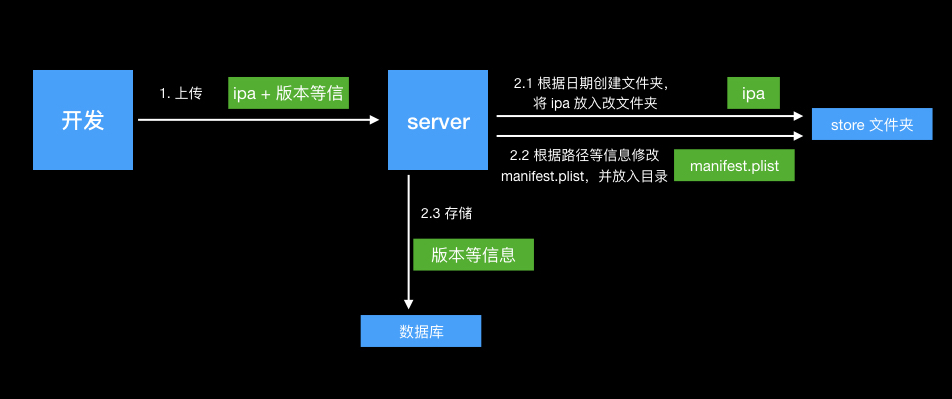
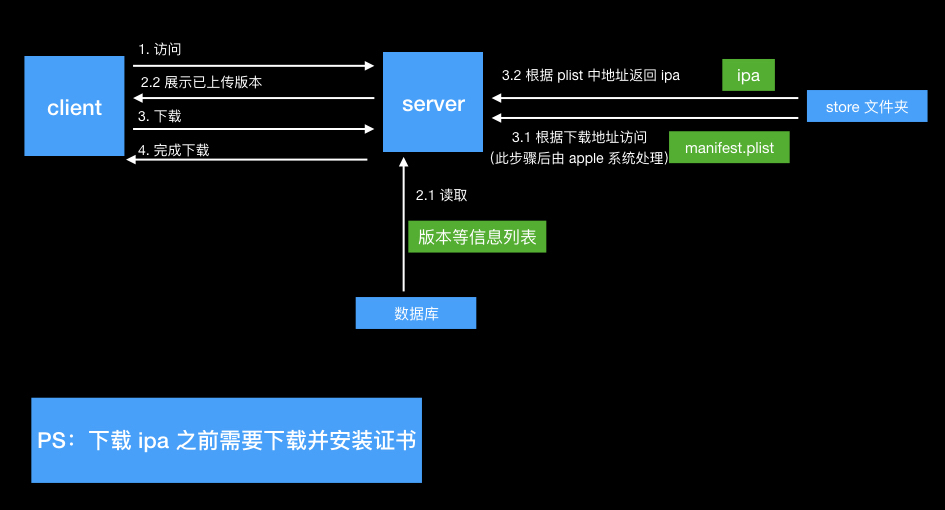

# 介绍
本项目是为了帮助 `开发` 和 `QA` 同学解决测试时需要设备与 pc 连线、同步等麻烦的操作，将 iOS Ad hoc 包进行在线安装。多个步骤改为一键安装（so easy）。

## 使用前提 ：

1. `服务器`：安装本项目的电脑（小弟用的就是自己的开发机），用来存储 ipa 和相关信息以及下发 ipa 。
2. 需要设备可以访问到`"服务器"`（不然怎么下载呀 ^_^!）。
3. ipa 需要是Ad hoc （设备需要提前加入开发者证书设备列表中）或者企业证书的包。
 
# 使用说明

## 初始化
请打开[安装包下载平台说明](./configuration/安装包下载平台说明.md)，进行 mysql、证书的初始化处理。

## 配置
### 添加项目
在`./source/projectJson`中，参考`projectJSONTemplate.json`填充`projectConfig.json`。非`iOS`的项目会直接下载源文件。

## 使用地址
`project 列表地址`服务器的默认地址为列表地址（就是直接输入服务器的地址+端口就会跳转到）
`ipa 列表地址`，通过 `project 列表地址` 下载跳转。
`上传地址`，通过 `project 列表地址` 上传跳转

## 特殊情况处理

`服务器`的 ip 地址被更换：

* 待处理 ：
    1. 更新证书。
    2. 更新本地的 plist 文件中的下载地址。

* 处理方式：

    1. 证书更新：使用`./configuration/certificate.sh`脚本重新生成即可，使用设备需要进行新证书的安装。
    2. plist 修改：打开 `/secretRoot.html`,输入新的 `host (eg. 192.169.12.6) ` 即可完成修改。

# 项目说明

## 主要结构内容介绍
1. `manifest.plist`：这是用来告诉设备从哪里下载 ipa，以及 ipa 的部分信息的文件。[存储位置 ` ./source/plist/manifest.plist`](./source/plist/manifest.plist)。
2. `证书`：因为苹果的要求下载必须使用 https，所以需要根据【服务器】的 ip 生成对应的 CA 证书（PS：本项目生成的是 CA 根证书）。
3. `服务`：使用的 nodeJS。用来处理上传的 ipa 的信息记录和存储规划；对应的列表用来展示下载；证书的下发。
4. `数据库`：用来存储、读取 ipa 的相关信息。

## 流程图

### 上传

### 下载
